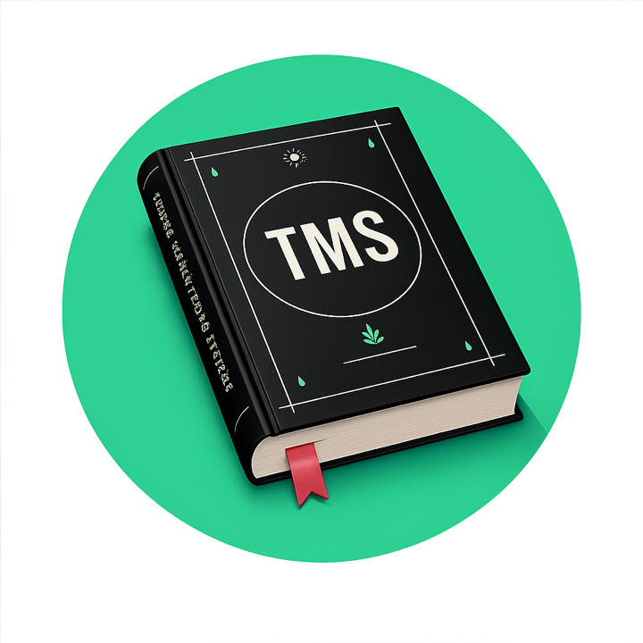

<p align="center">
  
</p>

<h1 align="center">Tanaab Canon</h1>

<p align="center">
  This project is the canonical home for Tanaab engineering, brand, marketing, and other operating guidance, plus the Codex plugin used to execute and enforce the live agent-facing slice of that canon.
</p>

<p align="center">
  <a href="https://github.com/tanaabased/canon/releases/latest"></a>
  <a href="https://github.com/tanaabased/canon/actions/workflows/pr-checks.yml"></a>
  <a href="./LICENSE"></a>
</p>

## Overview

Outside the Codex plugin surface, the main Markdown canon lives in a small set of top-level folders.

- [`guidance/`](./guidance/) holds durable policy, architecture, and design-shaping docs that should influence decisions but do not need to trigger as skills.
- [`ideas/`](./ideas/) holds proposals, deferred designs, and revisit notes that are not adopted canon yet.
- [`references/`](./references/) holds stable lookup material such as standards, contracts, naming rules, repo-structure rules, and testing doctrine.
- [`prompts/`](./prompts/) holds reusable prompts with cross-task value, such as project maintenance and optimization workflows.
- [`templates/`](./templates/) holds canonical copy/adapt starters, shared scaffolds, and reusable workflow templates that have proven human or cross-skill value.

## Usage

Canon is executed and enforced through the Codex plugin rooted at [`.codex-plugin/plugin.json`](./.codex-plugin/plugin.json). Today that plugin bundles skills plus a stub [`.mcp.json`](./.mcp.json) registry reserved for a future real shared MCP surface.

The live skills are:

- [`tanaab-changelog-author`](./skills/changelog-author/) owns `CHANGELOG.md` drafting, maintenance, and changelog-contract alignment.
- [`tanaab-github-action-author`](./skills/github-action-author/) shapes GitHub Action product surfaces such as `action.yml`, committed runtime files, and action README contracts.
- [`tanaab-github-workflow-author`](./skills/github-workflow-author/) owns GitHub Actions workflow graphs, including triggers, permissions, reusable workflows, and job topology.
- [`tanaab-javascript-author`](./skills/javascript-author/) handles JavaScript, TypeScript, and Bun implementation work, especially low-coupling helpers and utility logic.
- [`tanaab-javascript-cli-author`](./skills/javascript-cli-author/) owns true JavaScript or TypeScript Bun CLI product surfaces such as entrypoints, help output, versioning, and packaging contracts.
- [`tanaab-javascript-repo-standardizer`](./skills/javascript-repo-standardizer/) standardizes JavaScript, TypeScript, and Bun repo baselines such as workspace layout, linting, formatting, type-checking, and baseline scripts.
- [`tanaab-project-author`](./skills/project-author/) creates the GitHub repository that represents a project and audits or synchronizes its managed settings against canon.
- [`tanaab-project-optimizer`](./skills/project-optimizer/) audits applicable project surfaces read-only and produces a staged, skill-owned improvement plan.
- [`tanaab-readme-author`](./skills/readme-author/) structures and rewrites repository README surfaces.
- [`tanaab-release-author`](./skills/release-author/) prepares GitHub Release drafts from changelog entries, version decisions, and release-readiness checks.
- [`tanaab-shell-cli-author`](./skills/shell-cli-author/) owns Bash and PowerShell CLI surfaces, including wrappers, help output, and shell safety behavior.
- [`tanaab-skill-author`](./skills/skill-author/) scaffolds, standardizes, and validates canon skills.
- [`tanaab-task-completion-check`](./skills/task-completion-check/) assesses whether a GitHub-backed task is complete or ready from its acceptance criteria, linked pull requests, reviews, checks, and failure evidence.
- [`tanaab-vitepress-author`](./skills/vitepress-author/) owns VitePress docs and static-site surfaces.
- [`tanaab-vue-author`](./skills/vue-author/) owns Vue 3 frontend implementation surfaces such as components and Composition API flows.

## Installation

Versioned release archives are published on the [GitHub releases page](https://github.com/tanaabased/canon/releases). The preferred install path is:

1. Download the release archive for the version you want.
2. Extract it into `~/.codex/plugins/tanaab`.
3. Create or update `~/.agents/plugins/marketplace.json` so it points at that plugin directory.
4. Open the Plugins view in Codex and install `Tanaab Maneuvering Systems` from your personal marketplace.

Example personal marketplace entry:

```json
{
  "name": "personal",
  "interface": {
    "displayName": "Personal Plugins"
  },
  "plugins": [
    {
      "name": "tanaab",
      "source": {
        "source": "local",
        "path": "./.codex/plugins/tanaab"
      },
      "policy": {
        "installation": "AVAILABLE",
        "authentication": "ON_INSTALL"
      },
      "category": "Productivity"
    }
  ]
}
```

- If `~/.agents/plugins/marketplace.json` already exists, add the `tanaab` plugin entry instead of replacing the whole file.
- Codex resolves `source.path` relative to the marketplace root, so the `./.codex/plugins/tanaab` path is the important part.
- For the underlying plugin and marketplace rules, see the official Codex docs for [Plugins](https://developers.openai.com/codex/plugins) and [Build plugins](https://developers.openai.com/codex/plugins/build).

## Development

For live development, work from a local clone and symlink the repo into your Codex plugin directory.

```sh
git clone git@github.com:tanaabased/canon.git
cd canon
bun install

mkdir -p ~/.codex/plugins
ln -sfn "$PWD" ~/.codex/plugins/tanaab
```

- After the symlink is in place, add the same `tanaab` entry shown above to `~/.agents/plugins/marketplace.json`, then install the plugin from the Codex UI.
- Sync policy for live plugin surfaces is owned by [`AGENTS.md`](./AGENTS.md).
- The repo-local entrypoint for direct cache sync checks is `./bin/codexsync.js`; the public command label remains `codexsync`.
- For managed plugin or `codexsync` changes, run `bun run test`, `bun run lint`, `bun run codex:validate`, and `bun run codex:check`; if cache drift is reported, run `bun run codex:sync` and then `bun run codex:check` again.
- For targeted day-to-day validation, run the narrowest check that matches the surface you changed, such as:

```sh
bun skills/skill-author/scripts/validate-skill.js --skill-dir skills/javascript-author
```

## Issues, Questions and Support

- Open a task as a GitHub issue in [tanaabased/canon](https://github.com/tanaabased/canon) when the project has canon drift, broken skill behavior, stale references, or missing guidance.
- Route implementation work to the owning project or skill surface instead of overloading this repository with unrelated product fixes.

## Changelog

- See [CHANGELOG.md](./CHANGELOG.md) for release history.
- See the [GitHub releases page](https://github.com/tanaabased/canon/releases) for published release notes.

## License

- [MIT](./LICENSE)

## Contributors

<a href="https://github.com/tanaabased/canon/graphs/contributors">
  
</a>

Made with [contrib.rocks](https://contrib.rocks).
