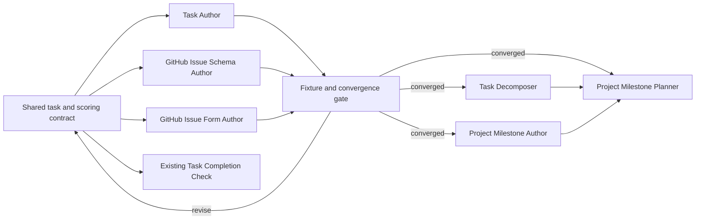

# Task Management Skills Roadmap

Status: active implementation roadmap; contract hypotheses remain under convergence review

Last researched: 2026-08-14

## Purpose

Build a small, coherent set of skills for GitHub-backed task management without creating one umbrella router or a separate skill for every verb.

In Canon terminology, a **task** is implemented as a GitHub issue, a **project** as a GitHub repository, and a **project milestone** as a GitHub milestone. GitHub-specific terms should remain in API, permission, and configuration guidance, while user-facing skill names should prefer the domain terms.

This roadmap focuses first on skill boundaries, task metadata, templates, and implementation order. The first product milestone is a converged task-authoring system: Task Author, GitHub Issue Schema Author, and GitHub Issue Form Author iterate against one shared contract until low-friction human intake can be normalized into mature Task, Bug, and Feature work across agent-authored, organization-native, and personal-repository fallback paths.

## Executive Recommendation

Build six narrowly owned skills over time:

1. **Task Author** for drafting, creating, revising, and normalizing one task.
2. **GitHub Issue Schema Author** for organization-level issue types and fields plus canonical repository labels.
3. **GitHub Issue Form Author** for checked-in Task, Bug, and Feature issue forms.
4. **Task Decomposer** for splitting one task into a parent and sub-issues.
5. **Project Milestone Author** for one milestone and its task membership.
6. **Project Milestone Planner** for deriving and creating the tasks needed by a milestone.

The first three skills form a convergence loop without becoming one umbrella skill:

- Task Author owns one task and its field values.
- GitHub Issue Schema Author owns organization-level type and field definitions plus canonical repository label definitions.
- GitHub Issue Form Author owns checked-in low-friction evidence forms, lossless intake extraction, and chooser configuration.
- The shared task contract owns the semantics all three must implement.

Phase 1 and phase 2 repeat until the three surfaces agree. Their combined exit is a fully fledged ability to create, revise, and normalize Task, Bug, and Feature work with accepted templates, native metadata where available, portable fallbacks where required, and explainable goal-independent scoring.

Keep the existing **Task Completion Check** as the read-only completion-evidence owner. Do not absorb it into Task Author.

Do not create separate Task Creator, Task Reworker, and Task Normalizer skills. Those operations share the same object, authorization boundary, metadata rules, and remote failure modes, so they should be modes of Task Author. Decomposition is different: it spans multiple issues and creates hierarchy, so it deserves a separate workflow.

## Implementation Checkpoint

Last reviewed: 2026-08-13

| Surface                          | Current state                                                                                                                                                                                                                                                                                                                                                                       | Remaining work                                                                                                                                                                                     |
| -------------------------------- | ----------------------------------------------------------------------------------------------------------------------------------------------------------------------------------------------------------------------------------------------------------------------------------------------------------------------------------------------------------------------------------- | -------------------------------------------------------------------------------------------------------------------------------------------------------------------------------------------------- |
| Shared contract and fixtures     | Human contract, machine-readable schema, descriptive fixtures, shared executable fixtures, and root-owned cross-skill intake-preservation coverage are checked in. The contract distinguishes human intake from canonical tasks and defines assessment ownership.                                                                                                                   | Continue calibration when cross-surface fixtures reveal material ambiguity.                                                                                                                        |
| Task Author                      | Capability discovery, deterministic drafting, assessment provenance, digest-gated create/revise/normalize, verified two-phase fallback migration, scoring, optional collapsed public score audits, T01-T16, R01, exact verification, and full-native live Task/Bug/Feature creation evidence exist. The broad Task body and required completion pull-request contract are accepted. | Calibrate the canonical Bug and Feature bodies with their human intake layers; decide whether the convergence gate also requires disposable live revise, normalize, and fallback-migration proofs. |
| GitHub Issue Schema Author       | Read-only inspection; digest-gated additive fields, retained-option colors, organization-members-only visibility, canonical repository-label definitions, and separately authorized field pinning exist. Field creation, colors, pinning, visibility, and disposable-repository labels are live-verified and idempotently aligned.                                                  | Keep any later rename, option, type, or destructive migration path separately authorized; no further initial-schema implementation is currently required.                                          |
| GitHub Issue Form Author         | Task, Bug, and Feature rendering, shared low-friction organization/personal evidence questions, lossless intake handoff, repository inspection, deterministic managed diffs, digest-authorized writes, exact verification, and earlier live scaffolding evidence exist. The Task questions and lossless mapping are accepted.                                                       | Calibrate Bug and Feature intake alongside their canonical normalized bodies; align the disposable repository only after all three kinds and their mappings are accepted.                          |
| Phase 1 and phase 2 convergence  | Core implementation and schema live proofs are complete; template calibration and the final cross-surface pass remain.                                                                                                                                                                                                                                                              | Exercise all three surfaces together until one full fixture pass produces no material contract changes, then align the accepted issue forms live.                                                  |
| Decomposition and milestone work | Deferred.                                                                                                                                                                                                                                                                                                                                                                           | Begin only after the three-skill convergence gate passes.                                                                                                                                          |

Keep the initial Task Author, GitHub Issue Schema Author, and GitHub Issue Form Author implementation on one integration branch until they form a discrete usable task-authoring system. After that core loop merges, implement decomposition and milestone surfaces as separately reviewable branches.

The installed Task Author created and exactly verified a synthetic [Task](https://github.com/tanaabased/agent-system-test/issues/50), [Bug](https://github.com/tanaabased/agent-system-test/issues/51), and [Feature](https://github.com/tanaabased/agent-system-test/issues/52) in the disposable `tanaabased/agent-system-test` repository on 2026-08-13. The live repository initially exercised native type and Priority, existing canonical labels, fallback Work size, Complexity, Impact, and Task score, plus versioned scoring comments. The installed Schema Author then created those four missing organization fields from an exact four-POST plan with no updates or deletions. A separate three-PATCH plan recolored only retained Work size, Complexity, and Impact options, preserving every option ID, name, description, priority, and order. The installed field-pinning path subsequently aligned Priority, Effort, Work size, Complexity, Impact, Task score, Start date, and Target date across Task, Bug, and Feature without changing field visibility or values; the pinned fields were confirmed visible on a live issue. All three schema paths verified and returned aligned idempotent plans on fresh reads.

The installed Schema Author later changed only Work size, Complexity, Impact, and Task score from public to organization-members-only visibility and independently aligned the canonical label definitions in `tanaabased/agent-system-test`. Both digest-authorized mutations exactly verified and now return aligned zero-operation plans. Against that fully native state, the installed Task Author created and exactly verified [Task #74](https://github.com/tanaabased/agent-system-test/issues/74), [Bug #75](https://github.com/tanaabased/agent-system-test/issues/75), and [Feature #76](https://github.com/tanaabased/agent-system-test/issues/76). Those proofs use native type, Work size, Complexity, Impact, and Task score; the Bug carries `regression`, the Feature carries `breaking change`, and all three intentionally omit arbitrary Priority, dates, fallback YAML, and public scoring-audit comments.

The installed Issue Form Author then created `.github/ISSUE_TEMPLATE/task.yml`, `bug.yml`, `feature.yml`, and `config.yml` on the disposable repository's exact `main` branch from a digest-authorized four-create plan with no updates or deletions. Live preview exposed GitHub's reserved `None` dropdown-option constraint, and a fresh correction plan verified exactly. That first live projection served its scaffolding purpose but is now superseded locally by the intake/canonical split: reporters no longer classify scoring diagnostics or fallback metadata, and the disposable repository remains unchanged until the final questions are reviewed and an exact new form plan is authorized.

The first optimization pass derived repeated field options from the machine schema, moved shared fixtures and equivalence coverage to the repo-owned test surface, and consolidated Schema Author's field transport, mutation parsing, and test fakes. These changes reduced parallel implementation without crossing the three skills' distinct mutation boundaries.

## GitHub Capability Snapshot

The current GitHub model is more capable than the older label-and-project-field model, but its surfaces have distinct scopes.

### Issue types

- Issue types are organization-level classifications. GitHub supplies Task, Bug, and Feature by default, and an organization may define up to 25 types.
- Organization owners manage the type catalog. A repository inherits its available types from its organization.
- Issue forms can set an issue type through their top-level `type` key.
- A user-owned repository has no organization issue-type catalog, so the task contract needs a fallback representation there.

Source: [Managing issue types in an organization](https://docs.github.com/en/issues/tracking-your-work-with-issues/using-issues/managing-issue-types-in-an-organization) and [Syntax for issue forms](https://docs.github.com/en/enterprise-cloud@latest/communities/using-templates-to-encourage-useful-issues-and-pull-requests/syntax-for-issue-forms).

### Issue fields

- GitHub **issue fields** are organization-level structured metadata, distinct from GitHub Projects custom fields.
- Current field types are single-select, text, number, and date. An organization may define up to 25 issue fields.
- GitHub creates Priority, Effort, Start date, and Target date when issue fields are enabled. Fields can be pinned to particular issue types.
- Issue fields are not available for user-owned repositories.
- Organization owners create and manage the schema. People with sufficient repository access set field values on individual issues.
- Issue fields are the native source of truth. A GitHub Projects field with the same meaning would be a second, potentially conflicting representation.

Source: [Managing issue fields in your organization](https://docs.github.com/en/issues/tracking-your-work-with-issues/using-issues/managing-issue-fields-in-your-organization), [Adding and managing issue fields](https://docs.github.com/en/issues/tracking-your-work-with-issues/using-issues/adding-and-managing-issue-fields), and [REST API endpoints for issue field values](https://docs.github.com/en/rest/issues/issue-field-values?apiVersion=2026-03-10).

### Current `tanaabased` state

A read-only probe on 2026-08-13 found:

- Task, Bug, and Feature are enabled for `tanaabased/canon`.
- Priority has Urgent, High, Medium, and Low options.
- Effort has High, Medium, and Low options.
- Start date and Target date are available.
- Work size, Complexity, Impact, and Task score are available; the three single-select fields also exactly match the canonical Tanaab-themed option colors.
- All four existing default issue fields currently use organization-members-only visibility.
- Work size, Complexity, Impact, and Task score now use organization-members-only visibility, matching Priority, Effort, Start date, and Target date.
- `tanaabased/agent-system-test` has aligned canonical task-label definitions. Canon itself still has GitHub's default repository labels plus its automation-owned labels; repository label synchronization remains explicitly repository-scoped rather than an organization-wide side effect.
- Canon has no repository-local issue forms, and no usable organization-default issue-form directory was found.

This means Task Author can exercise native types and the existing fields in the Tanaab organization while retaining its tested fallback capsule for personal repositories and other repositories where native field availability is proven absent.

### Forms, hierarchy, dependencies, and milestones

- Issue form inputs become ordinary Markdown in the issue body; they are not issue fields. Issue forms remain in public preview.
- A form can set Task, Bug, or Feature with the top-level `type` key, which supports a clean one-form-per-type design.
- Sub-issues provide native task hierarchy. GitHub currently allows up to 100 direct sub-issues per parent and up to eight levels of nesting.
- Issue dependencies provide native blocked-by relationships and should not be duplicated in free-form metadata.
- Milestones group issues and pull requests within one repository. This matches Canon's one-repository-per-project model.
- An organization or personal account can distribute default issue forms through a public `.github` repository, but any repository-local `.github/ISSUE_TEMPLATE` content overrides the entire default issue-template directory.

Sources: [About issue and pull request templates](https://docs.github.com/en/communities/using-templates-to-encourage-useful-issues-and-pull-requests/about-issue-and-pull-request-templates), [Adding sub-issues](https://docs.github.com/en/issues/tracking-your-work-with-issues/using-issues/adding-sub-issues), [REST API endpoints for issue dependencies](https://docs.github.com/en/rest/issues/issue-dependencies?apiVersion=2026-03-10), [Creating and editing milestones](https://docs.github.com/en/issues/using-labels-and-milestones-to-track-work/creating-and-editing-milestones-for-issues-and-pull-requests), and [Creating a default community health file](https://docs.github.com/en/communities/setting-up-your-project-for-healthy-contributions/creating-a-default-community-health-file).

## Adopted Contract

The roadmap owns sequencing, skill boundaries, and convergence status. It does not restate the implemented task contract.

- [`task-management-contract.md`](../references/task-management-contract.md) owns human-readable task semantics, metadata authority, fallbacks, scoring, labels, lifecycle rules, authorization, and verification.
- [`task-management-schema.json`](../references/task-management-schema.json) owns machine-readable issue types, body shapes, field options, colors, pinning, and labels.
- [`task-management-fixtures.md`](../references/task-management-fixtures.md) owns descriptive golden scenarios.
- [`task-management-fixtures.js`](../test/task-management-fixtures.js) and [`task-management-equivalence.spec.js`](../test/task-management-equivalence.spec.js) own shared executable evidence and cross-skill equivalence.

The durable architectural decisions are: distinguish low-friction intake evidence from canonical tasks; make Task Author the semantic normalization and assessment owner; keep Priority and scheduling human- or policy-controlled; require source and rationale for agent estimates; derive Task score deterministically; keep canonical organization fields organization-members-only; treat the collapsed public scoring audit as optional explanation rather than score storage; prefer native GitHub metadata with partial visible fallbacks; preserve Effort separately from Work size; keep Complexity model-neutral; keep `task-score/v1` goal-independent; resolve targets conservatively; require exact mutation previews; and verify every remote write. Change those decisions in the contract and shared fixtures first, then update each skill projection.

## Proposed Skill Portfolio

### 1. `tanaab-task-author`

- **Type:** `integration`
- **Priority:** first implementation
- **Owned surface:** one GitHub-backed task and its directly managed metadata
- **Modes:** draft, create, revise, normalize

Own drafting, creation, revision, and normalization for one task plus its directly managed native or fallback values. Keep schema definitions, checked-in forms, multi-task decomposition, milestone planning, and completion assessment outside this boundary. Draft, create, revise, normalize, fallback migration, exact managed diffs, and post-write verification are implemented; the broad Task body is accepted while Bug and Feature remain under template calibration.

### 2. `tanaab-github-issue-schema-author`

- **Type:** `integration`
- **Priority:** core phase 1 and phase 2 convergence loop
- **Owned surface:** one organization's GitHub issue-type and issue-field schema plus the canonical label projection for one repository
- **Modes:** inspect and synchronize

Own GitHub-specific organization type and field definitions, field pinning, and the canonical repository-label projection. Preserve unmanaged state and isolate high-risk effects. Additive fields, retained-option colors, visibility, label synchronization, and pinning are complete; destructive or value migrations remain separately authorized future slices.

### 3. `tanaab-github-issue-form-author`

- **Type:** `integration`
- **Priority:** core phase 1 and phase 2 convergence loop
- **Owned surface:** checked-in GitHub issue forms and template-chooser configuration
- **Variants:** Task, Bug, and Feature

Own the four checked-in repository form files, organization and personal variants, lossless evidence extraction, safe managed merges, digest-authorized writes, and exact verification. Forms are intake adapters, not canonical task renderers: Task and Feature use two required responses, Bug uses three, and each has one optional context response. Keep the skill separate because repository files have different permissions and failure modes from task and organization-schema mutation. Task Author owns semantic normalization, metadata assessment, and canonical rewriting. The remaining work is exact prompt calibration, disposable-repository realignment after approval, and later organization-default distribution.

### 4. `tanaab-task-decomposer`

- **Type:** `workflow`
- **Priority:** after the phase 1 and phase 2 convergence gate
- **Owned surface:** decomposition of one task into a coherent parent and native sub-issues

Responsibilities:

- Inspect the parent task, comments, linked work, acceptance criteria, and constraints.
- Decide whether a split is warranted rather than splitting by default.
- Require decomposition review at Work size `13` and normally split Work size `21` before execution.
- Propose independently completable child tasks with non-overlapping acceptance criteria.
- Identify shared constraints, ordering, and native dependencies.
- Show the complete proposed hierarchy before mutation.
- After approval, create children, attach them as sub-issues, add necessary dependencies, and revise the parent into an outcome-and-rollup role.
- Verify every child and relationship and report partial creation without hiding it.

The default should stay shallow. Native support for deep nesting is a platform limit, not a design target.

### 5. `tanaab-project-milestone-author`

- **Type:** `integration`
- **Priority:** after convergence, independent of Task Decomposer
- **Owned surface:** one repository-scoped project milestone and its explicit task membership
- **Modes:** inspect, create, revise, close, and synchronize membership

Responsibilities:

- Require or conservatively resolve one project repository.
- Author milestone title, bounded outcome, scope, completion conditions, and optional due date.
- Create or revise one milestone after showing the exact diff.
- Add or remove explicitly selected tasks from the milestone with a membership diff.
- Never create missing tasks merely because a milestone exists.
- Verify milestone state and every requested task assignment.

### 6. `tanaab-project-milestone-planner`

- **Type:** `workflow`
- **Priority:** after Task Decomposer and Project Milestone Author
- **Owned surface:** planning and materializing the task set needed to achieve one project milestone

Responsibilities:

- Inspect the milestone, repository context, existing tasks, relevant plans, and delivered work.
- Define the milestone's completion argument before proposing tasks.
- Reuse existing tasks where they already cover the work.
- Propose missing tasks, decomposition, dependencies, and milestone membership as one reviewable plan.
- Detect overlap, gaps, and tasks that are too broad.
- After approval, create only the missing tasks, establish relationships, and synchronize membership.
- Verify the resulting milestone plan without claiming the milestone itself is complete.

This remains separate from Project Milestone Author because planning a multi-task delivery graph has different checkpoints and partial-failure behavior from mutating one milestone.

## Relationship to Existing Skills

- **Project Author** continues to own GitHub repository creation and canonical repository settings. It does not absorb task, milestone, schema, or issue-form management.
- **Task Completion Check** continues to own read-only completion assessment from acceptance criteria and delivery evidence.
- **Task Author** may eventually apply an explicitly authorized close or reopen operation, but it must not reinterpret completion evidence. If closure develops materially different authorization or audit needs, reconsider a separate Task State Author then rather than scaffolding it now.
- **Project Optimizer** may later assess whether a repository has the expected task-management surfaces, but it should route concrete corrections to the owning skills rather than duplicate their contracts.

## Dependency Map

## Implementation Roadmap

### Phase 0: adopt the task contract

Status: complete. The adopted contract, schema, descriptive fixtures, and shared executable fixtures own this material. Reopen this phase only for an explicit contract revision surfaced by convergence evidence.

### Phase 1: build task authoring and form surfaces

Completed: capability discovery; deterministic Task, Bug, and Feature drafting; metadata assessment provenance; digest-gated create; exact verification; low-friction organization and personal issue-form variants; managed repository form alignment machinery; and cross-skill intake-preservation coverage.

Completed in code: Task Author revise, normalize, and two-phase fallback migration; T16 and R01; exact managed diffs; digest-gated publication; and post-write verification.

Remaining: calibrate and accept Bug and Feature human intake, canonical normalized body templates, and their evidence mappings. The Task slice and full-native live Task/Bug/Feature creation evidence are complete.

### Phase 2: build schema management and calibrate scoring

Completed: read-only inspection; desired schema capture; digest-gated additive field creation; retained-option color synchronization; separately authorized field pinning; and reproducible goal-independent scoring.

Completed in code: separately authorized visibility-only synchronization and canonical repository-label create/update synchronization with association verification and no rename or deletion path.

Remaining: preserve associations through any later high-risk migration path and calibrate scoring and Complexity classifications against the complete fixture corpus. Organization-members-only visibility and canonical labels are live-verified and aligned.

### Phase 1 and phase 2 convergence loop

Repeat phase 1 and phase 2 as one product loop:

1. Adjust the shared task, metadata, and scoring contract.
2. Render representative Task, Bug, and Feature fixtures through Task Author.
3. Render low-friction GitHub issue forms, preserve their evidence losslessly, and normalize that evidence into the canonical task shape.
4. Inspect and diff the organization schema and repository label projection.
5. Exercise native organization fields, canonical label transitions, and personal-repository fallback metadata.
6. Calculate Task scores and review their factor explanations.
7. Compare ranking and Complexity routing with human judgment.
8. Reconcile template, form, schema, rubric, scoring, and migration findings in their owning surfaces.
9. Repeat until the convergence gate passes.

Use fixtures that include:

- several Tasks, Bugs, and Features;
- small and oversized work;
- low- and high-complexity work;
- high-impact expensive work and low-impact inexpensive work;
- urgent defects and time-insensitive maintenance;
- work that enables or blocks several other tasks;
- untriaged submissions, Bugs missing reproduction evidence, regressions, and documented external blockers;
- uncertain or underspecified submissions;
- organization-native and personal-repository fallback targets.

The convergence gate passes only when:

- Human intake and canonical normalized Task, Bug, and Feature templates are accepted as distinct but convergent authoring surfaces.
- Agent-created tasks and semantically normalized form or external submissions converge on the same canonical body and metadata contract without requiring intake headings to mirror canonical headings.
- Task and Feature intake require only two evidence responses, Bug requires three, and no public form asks reporters to estimate metadata, scoring diagnostics, labels, or scheduling commitments.
- Every accepted estimate exposes provenance and rationale; Priority and dates remain human- or policy-controlled, while Task score remains derived.
- Work size, Complexity, and Impact each have a concrete, non-overlapping rubric.
- Work size is independently managed while Effort remains preserved and unused by canonical task workflows.
- Canonical labels have the approved names, purposes, and colors; lifecycle labels transition predictably without disturbing project-specific or automation-owned labels.
- Fixture ranking broadly matches human judgment and every score is reproducible and explainable.
- Complexity classifications support sensible downstream execution-tier selection without naming a model.
- Task score remains goal-independent and missing evidence remains unset rather than falsely precise.
- Native and fallback paths both pass their focused tests.
- Another full fixture pass produces no material contract, schema, form, or scoring changes.
- Task Author, GitHub Issue Schema Author, and GitHub Issue Form Author validate independently and retain their separate permission and failure boundaries.

Calibrate one task kind at a time, then recheck all three together at the gate. The accepted Task slice is the first provisional contract; Bug and Feature remain executable calibration artifacts. Until the gate passes, cross-kind fixture or live-submission evidence may still require an explicit shared-contract revision. Passing the gate records the accepted two-layer template contract and freezes those surfaces for routine use; later changes require an explicit contract revision rather than incidental scaffolding work.

Only after this gate passes should the roadmap advance to decomposition and project milestone work.

### Phase 3: add decomposition and milestone authorship

Task Decomposer and Project Milestone Author can be developed independently once the phase 1 and phase 2 convergence gate passes.

For Task Decomposer:

1. Implement recommendation-only decomposition.
2. Add overlap, independence, and acceptance-criteria checks.
3. Add approved sub-issue creation and relationship verification.

For Project Milestone Author:

1. Implement milestone inspection and draft rendering.
2. Add create and revise.
3. Add explicit membership synchronization with a stable diff.

Exit criteria:

- A broad task can become a verified shallow hierarchy after one approval checkpoint.
- A milestone can be authored and assigned explicit existing tasks without creating new work implicitly.

### Phase 4: build Project Milestone Planner

1. Begin read-only: compare the milestone outcome with existing tasks and repository evidence.
2. Produce a gap-and-overlap report plus a proposed task graph.
3. Add approved materialization of missing tasks, hierarchy, dependencies, and membership.
4. Verify the entire resulting graph and expose partial failures task by task.

Exit criteria:

- The planner reuses existing tasks before proposing new ones.
- Every proposed task contributes distinct milestone coverage.
- Creation is separated from planning by a clear approval checkpoint.

## Nice-to-Have Skills and Deferred Work

Do not scaffold these until repeated use proves the need.

### Task Triage

A batch workflow for reviewing an intake queue, identifying duplicates, proposing type and metadata, and producing normalization diffs. Single-task normalization already belongs to Task Author, so this is justified only when backlog-scale triage becomes common.

### Task Dependency Author

A focused integration for inspecting and changing arbitrary blocked-by relationships between existing tasks. Task Decomposer and Project Milestone Planner can set dependencies within their owned workflows. Create this only if dependency editing becomes a frequent standalone request.

### Task State Author

A close, reopen, or state-reason mutation surface gated by Task Completion Check evidence. First test whether an explicit close or reopen mode can remain safely inside Task Author; split only if the authorization and audit boundary proves materially different.

### GitHub Projects board management

Defer board creation, views, workflows, and project-level custom fields. A GitHub Projects board is an optional planning view, not the project's identity or task source of truth. Revisit only after native tasks, milestones, fields, sub-issues, and dependencies leave a concrete unmet planning need.

### Goal-aware scoring

Keep `task-score/v1` goal-independent. A project milestone may select the backlog being ranked, but it does not change the stored base score. Revisit goal-aware or strategic ranking only after Tanaab adopts a durable goal identity, authority, and reference contract. Prefer a contextual score or bounded alignment overlay over rewriting the stable base score whenever goals change.

Do not add Goal or Goal alignment issue fields in the initial schema. A future design must first establish whether the authoritative context is an explicit goal reference, a project milestone, a declared repository planning file, or another cross-project surface.

### Additional task types and issue fields

Defer Epic, Chore, Question, Severity, Area, Confidence, and workflow Status fields until repeated cross-repository evidence supports them. Confidence remains a visible scoring diagnostic in the first version rather than another persisted field. Prefer:

- Task plus labels for chores and internal categories;
- a parent task for hierarchical work;
- a project milestone for a bounded project outcome;
- discussions or support surfaces for open-ended questions when appropriate;
- native issue state instead of a duplicate Status field.

## Current Build Recommendation

Complete the first usable phase 1 and phase 2 convergence loop on the shared core branch:

1. **Completed:** apply and verify the independently authorized organization-members-only visibility plan for Work size, Complexity, Impact, and Task score.
2. **Completed:** apply and verify the independently authorized canonical-label plan for `tanaabased/agent-system-test`.
3. **Completed:** create and exactly verify a fully native Task, Bug, and Feature in that disposable repository from three separately displayed and authorized plans.
4. **Completed for Task:** accept the broad Task body, low-friction Task form, lossless evidence mapping, and required completion pull-request gate.
5. **Next:** calibrate Bug, then Feature, against representative submissions and the full fixture corpus. Recheck all three layers together, then align the disposable repository through a fresh exact plan.
6. Run the complete fixture corpus across all three skills, revise the contract and schema only when evidence warrants it, and repeat until the convergence gate passes. Decide explicitly whether live revise, normalize, or fallback-migration evidence is required before declaring convergence.
7. Merge the core task-management branch as one discrete usable system; begin decomposition and milestone work on separate branches afterward.

The ownership, schema, and mutation architecture are settled. The main remaining question is calibrational: the shared fixtures still need to establish whether the intake prompts, canonical normalized templates, scoring order, Complexity classifications, and native/fallback convergence match human judgment. See [`task-management-core-handoff.md`](./task-management-core-handoff.md) for the branch transfer context and restart procedure.
