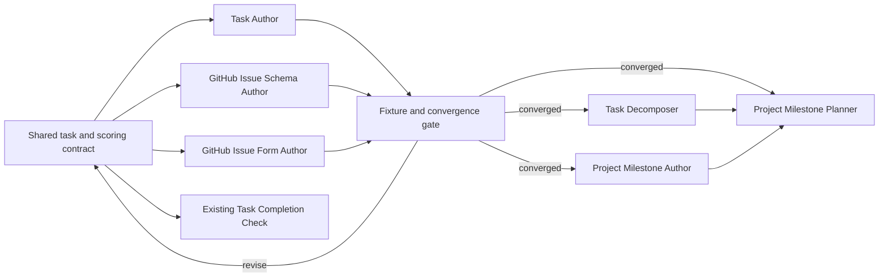

# Task Management Skills Roadmap

Status: active implementation roadmap; contract hypotheses remain under convergence review

Last researched: 2026-08-13

## Purpose

Build a small, coherent set of skills for GitHub-backed task management without creating one umbrella router or a separate skill for every verb.

In Canon terminology, a **task** is implemented as a GitHub issue, a **project** as a GitHub repository, and a **project milestone** as a GitHub milestone. GitHub-specific terms should remain in API, permission, and configuration guidance, while user-facing skill names should prefer the domain terms.

This roadmap focuses first on skill boundaries, task metadata, templates, and implementation order. The first product milestone is a converged task-authoring system: Task Author, GitHub Issue Schema Author, and GitHub Issue Form Author iterate against one shared contract until Task, Bug, and Feature creation is mature across agent-authored, form-authored, normalized, organization-native, and personal-repository fallback paths.

## Executive Recommendation

Build six narrowly owned skills over time:

1. **Task Author** for drafting, creating, revising, and normalizing one task.
2. **GitHub Issue Schema Author** for organization-level issue types and fields plus canonical repository labels.
3. **GitHub Issue Form Author** for checked-in Task, Bug, and Feature issue forms.
4. **Task Decomposer** for splitting one task into a parent and sub-issues.
5. **Project Milestone Author** for one milestone and its task membership.
6. **Project Milestone Planner** for deriving and creating the tasks needed by a milestone.

The first three skills form a convergence loop without becoming one umbrella skill:

- Task Author owns one task and its field values.
- GitHub Issue Schema Author owns organization-level type and field definitions plus canonical repository label definitions.
- GitHub Issue Form Author owns checked-in repository forms and chooser configuration.
- The shared task contract owns the semantics all three must implement.

Phase 1 and phase 2 repeat until the three surfaces agree. Their combined exit is a fully fledged ability to create, revise, and normalize Task, Bug, and Feature work with accepted templates, native metadata where available, portable fallbacks where required, and explainable goal-independent scoring.

Keep the existing **Task Completion Check** as the read-only completion-evidence owner. Do not absorb it into Task Author.

Do not create separate Task Creator, Task Reworker, and Task Normalizer skills. Those operations share the same object, authorization boundary, metadata rules, and remote failure modes, so they should be modes of Task Author. Decomposition is different: it spans multiple issues and creates hierarchy, so it deserves a separate workflow.

## Implementation Checkpoint

Last reviewed: 2026-08-13

| Surface                          | Current state                                                                                                                                                                                                                                 | Remaining work                                                                                                      |
| -------------------------------- | --------------------------------------------------------------------------------------------------------------------------------------------------------------------------------------------------------------------------------------------- | ------------------------------------------------------------------------------------------------------------------- |
| Shared contract and fixtures     | Initial contract, machine-readable schema, label policy, fallback, scoring model, and fixture corpus are checked in.                                                                                                                          | Continue calibration when cross-surface fixtures reveal material ambiguity.                                         |
| Task Author                      | Capability discovery, deterministic drafting, digest-gated create, fallback rendering, scoring, T01-T15 drafts, T01-T06 fake creates, exact verification, and live hybrid Task/Bug/Feature evidence exist.                                    | Add revise, normalize, fallback migration, T16, and R01; complete full-native live creation after schema alignment. |
| GitHub Issue Schema Author       | Read-only inspection plus digest-gated, additive-only creation of missing Work size, Complexity, Impact, and Task score fields exists with fake-client and live `tanaabased` verification. A fresh post-write plan is aligned and idempotent. | Add separately authorized pinning, visibility, label, and high-risk migration paths.                                |
| GitHub Issue Form Author         | Read-only Task, Bug, and Feature rendering, organization and personal variants, F01, and T01-T06 equivalence exist.                                                                                                                           | Add repository inspection, managed diffs, authorized file writes, and live public-preview verification.             |
| Phase 1 and phase 2 convergence  | In progress.                                                                                                                                                                                                                                  | Exercise all three surfaces together until one full fixture pass produces no material contract changes.             |
| Decomposition and milestone work | Deferred.                                                                                                                                                                                                                                     | Begin only after the three-skill convergence gate passes.                                                           |

Keep the initial Task Author, GitHub Issue Schema Author, and GitHub Issue Form Author implementation on one integration branch until they form a discrete usable task-authoring system. After that core loop merges, implement decomposition and milestone surfaces as separately reviewable branches.

The installed Task Author created and exactly verified a synthetic [Task](https://github.com/tanaabased/agent-system-test/issues/50), [Bug](https://github.com/tanaabased/agent-system-test/issues/51), and [Feature](https://github.com/tanaabased/agent-system-test/issues/52) in the disposable `tanaabased/agent-system-test` repository on 2026-08-13. The live repository initially exercised native type and Priority, existing canonical labels, fallback Work size, Complexity, Impact, and Task score, plus versioned scoring comments. The installed Schema Author then created those four missing organization fields from an exact four-POST plan with no updates or deletions, verified every definition, and returned an aligned idempotent plan on a fresh read.

## GitHub Capability Snapshot

The current GitHub model is more capable than the older label-and-project-field model, but its surfaces have distinct scopes.

### Issue types

- Issue types are organization-level classifications. GitHub supplies Task, Bug, and Feature by default, and an organization may define up to 25 types.
- Organization owners manage the type catalog. A repository inherits its available types from its organization.
- Issue forms can set an issue type through their top-level `type` key.
- A user-owned repository has no organization issue-type catalog, so the task contract needs a fallback representation there.

Source: [Managing issue types in an organization](https://docs.github.com/en/issues/tracking-your-work-with-issues/using-issues/managing-issue-types-in-an-organization) and [Syntax for issue forms](https://docs.github.com/en/enterprise-cloud@latest/communities/using-templates-to-encourage-useful-issues-and-pull-requests/syntax-for-issue-forms).

### Issue fields

- GitHub **issue fields** are organization-level structured metadata, distinct from GitHub Projects custom fields.
- Current field types are single-select, text, number, and date. An organization may define up to 25 issue fields.
- GitHub creates Priority, Effort, Start date, and Target date when issue fields are enabled. Fields can be pinned to particular issue types.
- Issue fields are not available for user-owned repositories.
- Organization owners create and manage the schema. People with sufficient repository access set field values on individual issues.
- Issue fields are the native source of truth. A GitHub Projects field with the same meaning would be a second, potentially conflicting representation.

Source: [Managing issue fields in your organization](https://docs.github.com/en/issues/tracking-your-work-with-issues/using-issues/managing-issue-fields-in-your-organization), [Adding and managing issue fields](https://docs.github.com/en/issues/tracking-your-work-with-issues/using-issues/adding-and-managing-issue-fields), and [REST API endpoints for issue field values](https://docs.github.com/en/rest/issues/issue-field-values?apiVersion=2026-03-10).

### Current `tanaabased` state

A read-only probe on 2026-08-13 found:

- Task, Bug, and Feature are enabled for `tanaabased/canon`.
- Priority has Urgent, High, Medium, and Low options.
- Effort has High, Medium, and Low options.
- Start date and Target date are available.
- Work size, Complexity, Impact, and Task score are available and exactly match the additive canonical definitions.
- All four existing default issue fields currently use organization-members-only visibility.
- Canon still has GitHub's nine default repository labels plus the automation-created `dependencies`, `javascript`, and `github_actions` labels; the canonical task-label migration has not been applied.
- Canon has no repository-local issue forms, and no usable organization-default issue-form directory was found.

This means Task Author can exercise native types and the existing fields in the Tanaab organization while retaining its tested fallback capsule for the four missing canonical fields and for personal repositories.

### Forms, hierarchy, dependencies, and milestones

- Issue form inputs become ordinary Markdown in the issue body; they are not issue fields. Issue forms remain in public preview.
- A form can set Task, Bug, or Feature with the top-level `type` key, which supports a clean one-form-per-type design.
- Sub-issues provide native task hierarchy. GitHub currently allows up to 100 direct sub-issues per parent and up to eight levels of nesting.
- Issue dependencies provide native blocked-by relationships and should not be duplicated in free-form metadata.
- Milestones group issues and pull requests within one repository. This matches Canon's one-repository-per-project model.
- An organization or personal account can distribute default issue forms through a public `.github` repository, but any repository-local `.github/ISSUE_TEMPLATE` content overrides the entire default issue-template directory.

Sources: [About issue and pull request templates](https://docs.github.com/en/communities/using-templates-to-encourage-useful-issues-and-pull-requests/about-issue-and-pull-request-templates), [Adding sub-issues](https://docs.github.com/en/issues/tracking-your-work-with-issues/using-issues/adding-sub-issues), [REST API endpoints for issue dependencies](https://docs.github.com/en/rest/issues/issue-dependencies?apiVersion=2026-03-10), [Creating and editing milestones](https://docs.github.com/en/issues/using-labels-and-milestones-to-track-work/creating-and-editing-milestones-for-issues-and-pull-requests), and [Creating a default community health file](https://docs.github.com/en/communities/setting-up-your-project-for-healthy-contributions/creating-a-default-community-health-file).

## Design Decisions

### Use task terminology above the provider boundary

- Skill names and user-facing workflows use task and project milestone.
- API calls, error messages, and configuration files use issue, issue type, issue field, and milestone where GitHub mechanics are exact.
- Do not create a provider-neutral umbrella skill that dynamically routes to GitHub-specific skills. GitHub is the current implementation, and each skill should expose its real mutation boundary directly.

### Resolve a repository target conservatively

Target precedence should be:

1. An explicit issue URL, `OWNER/REPO#NUMBER`, or `OWNER/REPO` supplied by the user.
2. One unambiguous repository bound to the active Codex or OpenClaw project, verified through its GitHub remote.
3. Otherwise, stop and request `OWNER/REPO`.

Never infer a remote target from a directory name alone. Before a write, render the resolved `OWNER/REPO` in the task draft or mutation diff. An explicit request to create the displayed task is sufficient authorization for that exact create; revision, normalization, decomposition, milestone membership changes, and schema changes should show their managed diff before applying.

### Prefer native metadata without maintaining a universal mirror

Do not place a full duplicate of native GitHub metadata in every task body. A universal YAML mirror creates two writable sources of truth and will drift when someone edits the native sidebar fields.

Instead:

- Use native issue types, issue fields, labels, assignees, milestones, sub-issues, and dependencies when available.
- Add a visible fallback metadata capsule only for canonical values whose native representation is unavailable.
- Treat native metadata as authoritative whenever both representations exist accidentally.
- When a native field later becomes available, migrate the fallback value into it, verify the write, and remove that key from the capsule.
- Remove the capsule entirely when it becomes empty.

Use a visible fenced block rather than hidden HTML so humans can discover and edit fallback metadata:

````markdown
### Task metadata

```yaml
schema: tanaab/task-metadata/v1
mode: fallback
fallback:
  type: task
  priority: high
  work-size: 5
  complexity: medium
  impact: high
  task-score: 74
```
````

The capsule is partial by design. It contains only values unavailable natively for that repository. Canonical enum values should be lowercase in the capsule and mapped case-insensitively to the native GitHub option names.

### Keep schema mutation out of task mutation

Task Author may inspect available issue types and fields and set their values. It must not create or alter the organization schema as a side effect of authoring one task.

GitHub Issue Schema Author should own that administrative surface because:

- schema changes affect every repository in an organization;
- creating or modifying types and fields requires organization-owner authority;
- field deletion can permanently remove values from existing issues;
- schema inspection, exact diffing, authorization, and verification need a stricter failure boundary than ordinary task creation.

Task Author should degrade to the fallback capsule when a canonical field is unavailable and report that fact. It may suggest a separate schema-alignment pass but must still complete the requested task when a safe fallback exists.

### Separate work size, complexity, impact, and priority

These concepts are related but not interchangeable:

- **Work size** estimates the relative amount of delivery work. It is a separate canonical field using the Fibonacci-like sequence `1`, `2`, `3`, `5`, `8`, `13`, and `21`. GitHub's default Effort field may remain alongside it as unmanaged schema, but Tanaab task workflows do not rename, map, delete, or use Effort.
- **Complexity** estimates reasoning difficulty, ambiguity, novelty, coordination, and uncertainty. It is a stable interface for downstream execution-tier selection, not a model name and not a work-duration estimate.
- **Impact** estimates the expected local value of completing the task, independent of Work size. Combining effort into Impact would count cost twice when Task score also considers Work size.
- **Priority** remains an explicit human or policy override. It is not an input to the base score because using a summary judgment to generate another summary judgment would be circular.

Work size is relative rather than an hours estimate:

- `1` through `3` represents small, bounded work.
- `5` through `8` represents meaningful multi-step work.
- `13` requires a decomposition review.
- `21` normally means the task should be decomposed before execution.
- Unknown work remains unset rather than receiving a numeric sentinel.

The exact Complexity and Impact option labels require calibration in the phase 1 and phase 2 loop. Their definitions must remain stable after adoption even when downstream model mappings or organization priorities change.

### Start with goal-independent Task scoring

`task-score/v1` ranks local task value and execution economics without requiring a strategic goal contract. Goals, milestones, and future planning surfaces may later provide a contextual overlay, but they do not block or alter the initial stored base score.

The initial score should consider selected factors rather than every metadata field:

- Impact: expected local value if completed
- Urgency: cost of waiting, active deadlines, or ongoing pain
- Enablement: other work unblocked, recurring time saved, or risk reduced
- Work size: relative delivery cost
- Confidence: how trustworthy the available evidence and estimates are

Use this provisional shape until fixture calibration establishes exact weights and mappings:

```text
benefit = weighted impact + urgency + enablement
task score = normalize(benefit * confidence / sublinear work-size penalty)
```

Scoring rules:

- Store Task score as a number from 0 through 100 when enough evidence exists.
- Leave the score unset when evidence is insufficient; do not use zero to mean unknown.
- Exclude Complexity from ranking. Downstream consumers use it to select an execution tier and map that tier to whatever models are current.
- Exclude Priority from the formula. A human may override ordering through Priority and should provide a short rationale when it diverges materially from Task score.
- Version the formula and factor mappings so scores can be reproduced and recomputed.
- Show the factor values, evidence, formula version, and concise rationale whenever a score is calculated or changed.
- Recompute after relevant task evidence, field values, deadlines, dependencies, or the scoring contract changes.
- Use a sublinear Work size penalty so large high-value tasks are not automatically buried beneath every small cleanup.

Impact evidence varies by task type:

- For a Task, consider work unblocked, operational leverage, recurring time saved, maintenance burden removed, and risk reduction.
- For a Bug, consider severity, frequency, blast radius, data or security exposure, and users or workflows blocked.
- For a Feature, consider users or agents enabled, capability gaps closed, reach, and recurring value.

The first version intentionally has no Goal field and no goal-alignment factor. A repository or milestone can select the backlog being ranked without changing the stable base score. Goal-aware or strategic ranking remains deferred until Tanaab adopts a durable goal identity and authority contract.

### Verify every remote write

The current REST API can accept type, milestone, labels, assignees, and issue-field values during issue creation, but several values may be silently dropped when permissions or capabilities are missing. The installed GitHub CLI's high-level `issue create` and `issue edit` commands also do not expose current type or issue-field flags.

Implementation should therefore use a thin `gh api` client for the complete mutation, then re-read the issue and compare every managed field. A task is not successfully authored until title, body, type or fallback, requested issue fields or fallbacks, relationships, and other requested metadata are verified. Report partial success explicitly rather than returning only the new issue URL.

Source: [REST API endpoints for issues](https://docs.github.com/en/rest/issues/issues?apiVersion=2026-03-10).

## Initial Task Metadata Contract

Start with GitHub's existing concepts plus the minimum new fields needed for task estimation, routing, and ranking.

| Canonical concept          | Primary GitHub representation            | Body fallback | Initial rule                                                                                                |
| -------------------------- | ---------------------------------------- | ------------- | ----------------------------------------------------------------------------------------------------------- |
| Task kind                  | Issue type: Task, Bug, or Feature        | `type`        | Required                                                                                                    |
| Priority                   | Priority single-select issue field       | `priority`    | Optional human or policy override; excluded from Task score                                                 |
| Work size                  | Work size single-select issue field      | `work-size`   | Optional; `1`, `2`, `3`, `5`, `8`, `13`, or `21`                                                            |
| Complexity                 | Complexity single-select issue field     | `complexity`  | Optional until calibrated; stable downstream execution-tier input                                           |
| Impact                     | Impact single-select issue field         | `impact`      | Optional until calibrated; local value independent of Work size                                             |
| Task score                 | Task score number issue field            | `task-score`  | Derived `0` through `100`; unset when evidence is insufficient                                              |
| Planned start              | Start date issue field                   | `start-date`  | Optional ISO date                                                                                           |
| Target completion          | Target date issue field                  | `target-date` | Optional ISO date and urgency evidence                                                                      |
| Work state                 | Issue open/closed state and state reason | None          | Never duplicate as a custom Status field initially                                                          |
| Responsibility             | Assignees                                | None          | Never duplicate as Owner or DRI initially                                                                   |
| Project outcome or timebox | Milestone                                | None          | Use for grouping and ranking context, not as an initial score input                                         |
| Hierarchy                  | Parent issue and sub-issues              | None          | Use native relationships                                                                                    |
| Blocking                   | Issue dependencies plus `blocked` label  | None          | Native dependencies are authoritative for task blockers; use the label for documented external blockers too |
| Classification and intake  | Canonical repository labels              | None          | Use only the approved task-label vocabulary; do not duplicate type, fields, or score factors                |

GitHub Issue Schema Author treats Effort as unmanaged and preserved. It may report that Effort coexists with the canonical Work size field, but it must not propose renaming, deleting, or mapping Effort as part of routine schema alignment. Any later request to retire Effort would be an independently authorized migration outside this initial contract.

Potential future fields such as Severity or Area should be added only after repeated use across at least two repositories proves that the initial contract and labels are insufficient. Goal and goal alignment are intentionally deferred. Status, Owner, Milestone, Parent, and Blocked By are not candidates because GitHub already owns those concepts.

## Initial Body Shapes

The convergence loop should turn these starting shapes into accepted templates aligned one-to-one with GitHub's default types.

### Task

- Context
- Objective
- In scope and out of scope
- Acceptance criteria
- Constraints or notes

### Bug

- Observed behavior
- Expected behavior
- Reproduction or evidence
- Impact
- Acceptance criteria

### Feature

- Problem or opportunity
- Desired outcome
- In scope and out of scope
- Acceptance criteria
- Alternatives or constraints when material

All variants need explicit, checkable acceptance criteria because Task Completion Check treats missing criteria as uncertain. Do not add an Epic type initially: use a parent task for hierarchical work or a project milestone for a bounded outcome.

Every variant must capture enough evidence to estimate Work size, Complexity, Impact, and Task score without forcing the submitter to calculate the score. Organization forms rely on native issue fields pinned to the matching type and avoid duplicating those values in the body. Personal-repository forms expose unavailable metadata as stable labeled Markdown that Task Author can normalize deterministically into the fallback capsule.

The accepted templates must normalize to the same body and metadata contract whether the task began through Task Author, a GitHub issue form, or an external free-form submission.

## Proposed Skill Portfolio

### 1. `tanaab-task-author`

- **Type:** `integration`
- **Priority:** first implementation
- **Owned surface:** one GitHub-backed task and its directly managed metadata
- **Modes:** draft, create, revise, normalize

Responsibilities:

- Resolve and display the exact repository target.
- Inspect repository capabilities and available metadata.
- Render Task, Bug, or Feature body shape from the shared contract.
- Create one task with native metadata where available and fallback metadata where needed.
- Estimate or validate Work size, Complexity, and Impact from the task evidence and accepted rubrics.
- Calculate an explainable provisional Task score when evidence is sufficient and leave it unset otherwise.
- Preserve explicit Priority overrides without folding them back into the score.
- Revise an existing task after reviewing its body, comments, linked work, and newly discovered constraints.
- Normalize an externally submitted issue without inventing missing facts or discarding useful evidence.
- Keep legacy Effort evidence separate from Work size and never infer or propose a Work size value from it.
- Apply and remove existing canonical labels according to their lifecycle rules without creating or altering repository label definitions.
- Show an exact semantic diff before revising or normalizing.
- Preserve discussion history. Significant requirement changes should be summarized in a comment or a clearly maintained change-history section rather than erased from the record.
- Re-read and verify every managed value after mutation.

Non-responsibilities:

- Organization issue-type or issue-field schema changes and repository label-definition changes
- Checked-in GitHub issue forms or chooser configuration
- Creating multiple sub-issues
- Arbitrary dependency graph editing
- Milestone creation or portfolio planning
- Completion assessment
- GitHub Projects board management

### 2. `tanaab-github-issue-schema-author`

- **Type:** `integration`
- **Priority:** core phase 1 and phase 2 convergence loop
- **Owned surface:** one organization's GitHub issue-type and issue-field schema plus the canonical label projection for one repository
- **Modes:** inspect and synchronize

Responsibilities:

- Require an explicit organization target and organization-owner capability for type, field, or organization-default-label changes; require an explicit repository target and sufficient repository access for label synchronization.
- Inspect Task, Bug, and Feature availability, issue fields, current values, options, visibility, type pinning, organization default labels, repository labels, and current label use.
- Compare current state with a checked-in desired policy.
- Show an exact managed diff and require explicit authorization before writing.
- Add missing managed fields or options without replacing unrelated organization configuration.
- Preserve GitHub's default Effort field as unmanaged schema while independently managing Work size.
- Manage the Work size, Complexity, Impact, and Task score field definitions required by the adopted contract.
- Manage canonical label names, purposes, descriptions, and colors without silently deleting unmanaged or automation-owned labels.
- Keep Complexity option semantics model-neutral and preserve Task score as a derived number field.
- Treat deletion, renaming, visibility changes, option removal, and label migration as separately highlighted high-risk changes.
- Re-inspect after synchronization and report remaining drift.

#### Canonical repository labels

| Label                | Purpose                                                    | Color     |
| -------------------- | ---------------------------------------------------------- | --------- |
| `documentation`      | Documentation additions or improvements                    | `#2f81f7` |
| `breaking change`    | Requires consumer migration or coordination                | `#db2777` |
| `regression`         | Previously working behavior has degraded                   | `#e5484d` |
| `blocked`            | Cannot proceed because of a documented blocker             | `#7f1d1d` |
| `needs triage`       | Submitted but not yet normalized against the task contract | `#f59e0b` |
| `needs reproduction` | A Bug needs reproducible evidence before work can proceed  | `#f97316` |
| `good first issue`   | Well-bounded work suitable for a first contribution        | `#86e7c4` |
| `help wanted`        | Maintainers welcome outside contribution                   | `#00c88a` |

`blocked`, `needs triage`, and `needs reproduction` are bounded lifecycle signals rather than a general label-based Status system. A blocker must be identified through a native issue dependency, the task body, or a comment. Task Author should remove each lifecycle label when its condition clears, and should apply `good first issue` or `help wanted` only after triage. `regression` and `needs reproduction` apply only to Bugs.

The eight labels above are the canonical human-task vocabulary. A repository may declare at most two project-specific extensions before the shared contract should be reconsidered. Automation-owned labels such as Dependabot's `dependencies` may coexist but are not canonical task labels and should not be applied by Task Author. Schema inspection should report canonical, project-specific, automation-owned, and unmanaged labels separately. Label deletion must never be automatic because it removes the label from every associated issue and pull request.

This is provider-led because organization issue schema and its repository label projection are GitHub-specific administrative product surfaces, not the task itself. Keep their targets, authorization checks, diffs, and verification separate within the fixed inspect and synchronize modes.

### 3. `tanaab-github-issue-form-author`

- **Type:** `integration`
- **Priority:** core phase 1 and phase 2 convergence loop
- **Owned surface:** checked-in GitHub issue forms and template-chooser configuration
- **Variants:** Task, Bug, and Feature

Responsibilities:

- Generate or align `.github/ISSUE_TEMPLATE/task.yml`, `bug.yml`, and `feature.yml` from the adopted body contract.
- Set the matching top-level issue `type` in each organization-repository form.
- Collect the type-specific evidence needed to estimate Work size, Complexity, Impact, urgency, enablement, and confidence without asking the submitter to enter Task score.
- Rely on native issue fields pinned by GitHub Issue Schema Author for organization repositories and avoid duplicating their values in the body.
- Provide a personal-repository variant whose Markdown exposes unavailable metadata for deterministic normalization into the fallback capsule.
- Preserve repository-specific additions that do not contradict the required contract.
- Validate public-preview form syntax, resulting Markdown, and normalization through Task Author.
- Support repository-local forms first; later support organization defaults in a public `.github` repository as a distribution mode, not a separate skill.
- Warn that any repository-local issue-template content suppresses all organization-default issue templates for that repository.

The forms participate in the convergence loop from the beginning, but the skill remains separate because checked-in repository configuration has different tools, permissions, and failure modes from task mutation and organization schema administration.

### 4. `tanaab-task-decomposer`

- **Type:** `workflow`
- **Priority:** after the phase 1 and phase 2 convergence gate
- **Owned surface:** decomposition of one task into a coherent parent and native sub-issues

Responsibilities:

- Inspect the parent task, comments, linked work, acceptance criteria, and constraints.
- Decide whether a split is warranted rather than splitting by default.
- Require decomposition review at Work size `13` and normally split Work size `21` before execution.
- Propose independently completable child tasks with non-overlapping acceptance criteria.
- Identify shared constraints, ordering, and native dependencies.
- Show the complete proposed hierarchy before mutation.
- After approval, create children, attach them as sub-issues, add necessary dependencies, and revise the parent into an outcome-and-rollup role.
- Verify every child and relationship and report partial creation without hiding it.

The default should stay shallow. Native support for deep nesting is a platform limit, not a design target.

### 5. `tanaab-project-milestone-author`

- **Type:** `integration`
- **Priority:** after convergence, independent of Task Decomposer
- **Owned surface:** one repository-scoped project milestone and its explicit task membership
- **Modes:** inspect, create, revise, close, and synchronize membership

Responsibilities:

- Require or conservatively resolve one project repository.
- Author milestone title, bounded outcome, scope, completion conditions, and optional due date.
- Create or revise one milestone after showing the exact diff.
- Add or remove explicitly selected tasks from the milestone with a membership diff.
- Never create missing tasks merely because a milestone exists.
- Verify milestone state and every requested task assignment.

### 6. `tanaab-project-milestone-planner`

- **Type:** `workflow`
- **Priority:** after Task Decomposer and Project Milestone Author
- **Owned surface:** planning and materializing the task set needed to achieve one project milestone

Responsibilities:

- Inspect the milestone, repository context, existing tasks, relevant plans, and delivered work.
- Define the milestone's completion argument before proposing tasks.
- Reuse existing tasks where they already cover the work.
- Propose missing tasks, decomposition, dependencies, and milestone membership as one reviewable plan.
- Detect overlap, gaps, and tasks that are too broad.
- After approval, create only the missing tasks, establish relationships, and synchronize membership.
- Verify the resulting milestone plan without claiming the milestone itself is complete.

This remains separate from Project Milestone Author because planning a multi-task delivery graph has different checkpoints and partial-failure behavior from mutating one milestone.

## Relationship to Existing Skills

- **Project Author** continues to own GitHub repository creation and canonical repository settings. It does not absorb task, milestone, schema, or issue-form management.
- **Task Completion Check** continues to own read-only completion assessment from acceptance criteria and delivery evidence.
- **Task Author** may eventually apply an explicitly authorized close or reopen operation, but it must not reinterpret completion evidence. If closure develops materially different authorization or audit needs, reconsider a separate Task State Author then rather than scaffolding it now.
- **Project Optimizer** may later assess whether a repository has the expected task-management surfaces, but it should route concrete corrections to the owning skills rather than duplicate their contracts.

## Dependency Map



## Implementation Roadmap

### Phase 0: adopt the task contract

1. Turn the settled parts of this idea into a durable task contract under `references/`.
2. Finalize the metadata authority rules and `tanaab/task-metadata/v1` fallback schema.
3. Adopt the canonical label names, purposes, colors, lifecycle rules, extension limit, and automation-owned-label boundary.
4. Record the initial Work size, Complexity, Impact, and `task-score/v1` hypotheses without treating their scales or weights as proven.
5. Define the starting headings and evidence prompts for Task, Bug, and Feature.
6. Build a representative fixture corpus before implementing remote writes.
7. Define target resolution, mutation previews, permission handling, and post-write verification as shared behavior.
8. Decide how significant revisions record their history.

Exit criteria:

- One source of truth exists for task body and metadata semantics.
- Personal-repository fallback behavior is unambiguous.
- Native-versus-fallback migration rules are testable.
- Canonical label definitions and lifecycle transitions are testable without turning labels into a duplicate Status system.
- The fixture corpus covers each type, estimation extremes, score extremes, uncertain submissions, and both native and fallback repositories.
- Every unresolved scale or formula decision is explicitly marked as a hypothesis for phase 1 and phase 2 calibration.

### Phase 1: build task authoring and form surfaces

1. Scaffold `task-author` as an `integration` skill through Skill Author.
2. Keep the initial API client, rendering code, and tests local to the skill; do not hoist helpers before a second live consumer exists.
3. Implement read-only capability discovery and fixture rendering for Task, Bug, and Feature.
4. Scaffold `github-issue-form-author` separately and generate equivalent forms from the shared contract.
5. Validate that form-created Markdown normalizes to the same structure as Task Author output.
6. Implement Task Author create with exact post-write verification.
7. Implement revise and normalize as diff-first modes.
8. Add fake-client coverage for organization-native metadata, personal-repository fallback, missing types, missing fields, silently dropped writes, ambiguous targets, and partial failures.
9. Return rendered and normalized fixtures to phase 2 for schema and scoring evaluation.

Exit criteria:

- Every Task, Bug, and Feature fixture can be drafted through Task Author and the matching issue form.
- Agent-created, form-created, and normalized bodies conform to one contract.
- One task of each type can be created and verified in both organization-native and personal-repository fallback modes when explicitly authorized for an operational scenario.
- An existing task can be normalized or revised without losing evidence.
- Every write is verified and partial success is reported honestly.
- The phase produces concrete schema, rubric, and scoring feedback rather than declaring the templates final by itself.

### Phase 2: build schema management and calibrate scoring

1. Scaffold `github-issue-schema-author` as an `integration` skill through Skill Author.
2. Implement read-only inspection of issue types, field definitions, options, visibility, type pinning, the unmanaged Effort field, repository labels, and label use. Report organization-default labels as a manual surface until GitHub provides a public listing API.
3. Capture a checked-in desired schema covering Task, Bug, Feature, Priority, Work size, Complexity, Impact, Task score, Start date, Target date, and the canonical repository labels.
4. Preserve Effort independently, and produce exact legacy-label findings that retain every association without proposing automatic deletion.
5. Implement stable schema diffing and narrowly authorized synchronization with high-risk changes separated.
6. Pin native fields to the relevant issue types so organization forms do not duplicate them in the body.
7. Score the phase 1 fixtures with the current Impact, urgency, enablement, confidence, and sublinear Work size mappings.
8. Compare the fixture ordering with human judgment and compare Complexity classifications with expected execution tiers.
9. Return mismatches to phase 1 as template, evidence-prompt, or normalization changes and to phase 2 as rubric, field-option, or formula changes.
10. Test against fakes first; use live organization mutation only in an explicitly approved operational scenario.

Exit criteria:

- An authorized operator can inspect organization and repository alignment without writing.
- Missing managed schema can be added and existing estimates or labels migrated without touching unmanaged fields, automation-owned labels, or losing values and associations.
- Field or label deletion and destructive migration cannot occur accidentally.
- Scores are reproducible from a named formula version and visible factor evidence.
- Complexity remains a stable model-neutral interface whose downstream mapping can change independently.
- The phase produces concrete authoring and template feedback rather than declaring the schema final by itself.

### Phase 1 and phase 2 convergence loop

Repeat phase 1 and phase 2 as one product loop:

1. Adjust the shared task, metadata, and scoring contract.
2. Render representative Task, Bug, and Feature fixtures through Task Author.
3. Render the equivalent GitHub issue forms and normalize their output.
4. Inspect and diff the organization schema and repository label projection.
5. Exercise native organization fields, canonical label transitions, and personal-repository fallback metadata.
6. Calculate Task scores and review their factor explanations.
7. Compare ranking and Complexity routing with human judgment.
8. Reconcile template, form, schema, rubric, scoring, and migration findings in their owning surfaces.
9. Repeat until the convergence gate passes.

Use fixtures that include:

- several Tasks, Bugs, and Features;
- small and oversized work;
- low- and high-complexity work;
- high-impact expensive work and low-impact inexpensive work;
- urgent defects and time-insensitive maintenance;
- work that enables or blocks several other tasks;
- untriaged submissions, Bugs missing reproduction evidence, regressions, and documented external blockers;
- uncertain or underspecified submissions;
- organization-native and personal-repository fallback targets.

The convergence gate passes only when:

- Task, Bug, and Feature templates are accepted as fully fledged authoring surfaces.
- Agent-created, form-created, and externally normalized tasks converge on the same body and metadata contract.
- Work size, Complexity, and Impact each have a concrete, non-overlapping rubric.
- Work size is independently managed while Effort remains preserved and unused by canonical task workflows.
- Canonical labels have the approved names, purposes, and colors; lifecycle labels transition predictably without disturbing project-specific or automation-owned labels.
- Fixture ranking broadly matches human judgment and every score is reproducible and explainable.
- Complexity classifications support sensible downstream execution-tier selection without naming a model.
- Task score remains goal-independent and missing evidence remains unset rather than falsely precise.
- Native and fallback paths both pass their focused tests.
- Another full fixture pass produces no material contract, schema, form, or scoring changes.
- Task Author, GitHub Issue Schema Author, and GitHub Issue Form Author validate independently and retain their separate permission and failure boundaries.

Only after this gate passes should the roadmap advance to decomposition and project milestone work.

### Phase 3: add decomposition and milestone authorship

Task Decomposer and Project Milestone Author can be developed independently once the phase 1 and phase 2 convergence gate passes.

For Task Decomposer:

1. Implement recommendation-only decomposition.
2. Add overlap, independence, and acceptance-criteria checks.
3. Add approved sub-issue creation and relationship verification.

For Project Milestone Author:

1. Implement milestone inspection and draft rendering.
2. Add create and revise.
3. Add explicit membership synchronization with a stable diff.

Exit criteria:

- A broad task can become a verified shallow hierarchy after one approval checkpoint.
- A milestone can be authored and assigned explicit existing tasks without creating new work implicitly.

### Phase 4: build Project Milestone Planner

1. Begin read-only: compare the milestone outcome with existing tasks and repository evidence.
2. Produce a gap-and-overlap report plus a proposed task graph.
3. Add approved materialization of missing tasks, hierarchy, dependencies, and membership.
4. Verify the entire resulting graph and expose partial failures task by task.

Exit criteria:

- The planner reuses existing tasks before proposing new ones.
- Every proposed task contributes distinct milestone coverage.
- Creation is separated from planning by a clear approval checkpoint.

## Nice-to-Have Skills and Deferred Work

Do not scaffold these until repeated use proves the need.

### Task Triage

A batch workflow for reviewing an intake queue, identifying duplicates, proposing type and metadata, and producing normalization diffs. Single-task normalization already belongs to Task Author, so this is justified only when backlog-scale triage becomes common.

### Task Dependency Author

A focused integration for inspecting and changing arbitrary blocked-by relationships between existing tasks. Task Decomposer and Project Milestone Planner can set dependencies within their owned workflows. Create this only if dependency editing becomes a frequent standalone request.

### Task State Author

A close, reopen, or state-reason mutation surface gated by Task Completion Check evidence. First test whether an explicit close or reopen mode can remain safely inside Task Author; split only if the authorization and audit boundary proves materially different.

### GitHub Projects board management

Defer board creation, views, workflows, and project-level custom fields. A GitHub Projects board is an optional planning view, not the project's identity or task source of truth. Revisit only after native tasks, milestones, fields, sub-issues, and dependencies leave a concrete unmet planning need.

### Goal-aware scoring

Keep `task-score/v1` goal-independent. A project milestone may select the backlog being ranked, but it does not change the stored base score. Revisit goal-aware or strategic ranking only after Tanaab adopts a durable goal identity, authority, and reference contract. Prefer a contextual score or bounded alignment overlay over rewriting the stable base score whenever goals change.

Do not add Goal or Goal alignment issue fields in the initial schema. A future design must first establish whether the authoritative context is an explicit goal reference, a project milestone, a declared repository planning file, or another cross-project surface.

### Additional task types and issue fields

Defer Epic, Chore, Question, Severity, Area, Confidence, and workflow Status fields until repeated cross-repository evidence supports them. Confidence remains a visible scoring diagnostic in the first version rather than another persisted field. Prefer:

- Task plus labels for chores and internal categories;
- a parent task for hierarchical work;
- a project milestone for a bounded project outcome;
- discussions or support surfaces for open-ended questions when appropriate;
- native issue state instead of a duplicate Status field.

## Current Build Recommendation

Complete the first usable phase 1 and phase 2 convergence loop on the shared core branch:

1. Complete Task Author revise, normalize, and fallback-migration paths with T16, R01, exact managed diffs, publication safety, and post-write verification; create mode already has the digest-gated and verified foundation.
2. Add GitHub Issue Form Author repository inspection, exact managed diffs, and authorized writes only after preserving compatible repository-specific additions.
3. Continue GitHub Issue Schema Author synchronization in bounded steps by adding separately authorized pinning, visibility, label, and high-risk migration paths; the additive four-field path is live-verified.
4. Run the complete fixture corpus across all three skills, revise the contract and schema when evidence warrants it, and repeat until the convergence gate passes.
5. Merge the core task-management branch as one discrete usable system; begin decomposition and milestone work on separate branches afterward.

The remaining questions are calibration questions rather than missing scaffolding decisions: whether the prompts elicit reliable Work size, Complexity, Impact, urgency, enablement, and confidence evidence; whether `task-score/v1` ordering matches human judgment; and whether native and fallback forms preserve equivalent meaning without redundant metadata.
